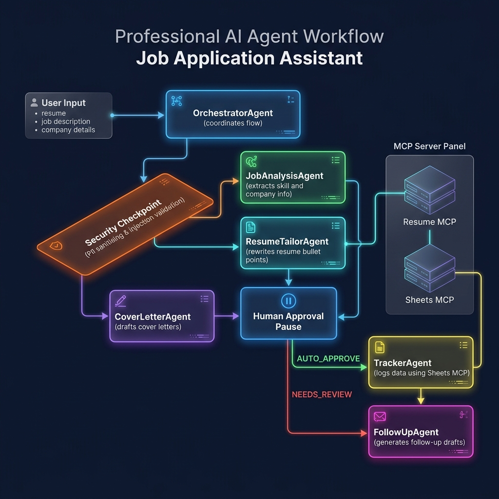

# 🎯 Submission Write-Up: Job Application Assistant Agent

**Track:** Concierge Agents (Personal Career Automation & Data Security)  
**Subtitle:** A secure, multi-agent AI assistant built with Google ADK 2.0 and Gemini to automate job searches while protecting user privacy.

---

## 1. Problem Statement
For individual job seekers, the modern application process is a highly repetitive, high-friction, and cognitively exhausting chore. A successful job search requires:
1.  **Job Analysis**: Manually extracting key requirements, deadlines, and core skills from lengthy job descriptions (JDs).
2.  **ATS Optimisation**: Tailoring resumes and cover letters specifically for each application to pass through Automated Tracking Systems (ATS) without inflating or fabricating experience.
3.  **Document Backups**: Generating, formatting, naming, and saving copies of tailored resumes (PDFs) on personal cloud storage (e.g. Google Drive) for version control.
4.  **Pipeline Tracking**: Logging each application's details (company, role, applied date, resume version used, status) in tracking spreadsheets.

Doing this manually takes **30 to 45 minutes per application**, leading to job-search fatigue. Additionally, sending raw, un-redacted personal information (PII) over external logs or spreadsheet pipelines, and managing API keys in web interfaces, poses severe privacy risks. 

The **Job Application Assistant** solves this by acting as a personal concierge agent that reduces this multi-step workflow down to **less than 2 minutes**, while ensuring that user data is sanitized, credential leaks are blocked, and versioned backups are automated.

---

## 2. Solution Architecture

The agent uses a modular, multi-agent orchestration architecture built on **Google ADK 2.0**. A centralized orchestrator routes user inputs through local security guardrails, invokes specialized sub-agents, and utilizes custom Model Context Protocol (MCP) servers and the Google Drive/Sheets APIs.

---

## 3. ADK Concepts & File References

The implementation utilizes core concepts of the **Google Agent Development Kit (ADK) 2.0**:

*   **ADK Workflow / Orchestration**: The root orchestrator is defined in **[agent.py](job_agent/agent.py)**. It manages state transitions between sub-agents and uses a sequential workflow model to coordinate job description analysis, resume tailoring, and logging.
*   **LlmAgent**: Every specialist is implemented as an independent `Agent` instance:
    *   **`job_analysis_agent`** in **[job_analysis_agent.py](job_agent/sub_agents/job_analysis_agent.py)** parses job requirements.
    *   **`resume_tailor_agent`** in **[resume_tailor_agent.py](job_agent/sub_agents/resume_tailor_agent.py)** incorporates relevant keywords into experience bullet points.
    *   **`cover_letter_agent`** in **[cover_letter_agent.py](job_agent/sub_agents/cover_letter_agent.py)** drafts tailored cover letters.
    *   **`tracker_agent`** in **[tracker_agent.py](job_agent/sub_agents/tracker_agent.py)** appends tracking logs.
    *   **`followup_agent`** in **[followup_agent.py](job_agent/sub_agents/followup_agent.py)** generates email templates.
*   **AgentTool**: Local functions are registered directly as tools on the agents. In **[resume_tailor_agent.py](job_agent/sub_agents/resume_tailor_agent.py)**, the function `generate_and_upload_resume_pdf` is bound as an agent tool to generate ReportLab PDFs and upload them to Google Drive.
*   **MCP Server (Model Context Protocol)**:
    *   `resume_server` in **[resume_server.py](mcp_servers/resume_server.py)** serves as a FastMCP file connector to expose the user's base resume.
    *   `sheets_server` in **[sheets_server.py](mcp_servers/sheets_server.py)** wraps the standard Sheets MCP server to redirect stderr logging, resolving channel corruption issues.
*   **Security Checkpoint**: Implemented in **[input_validator.py](security/input_validator.py)** and **[output_filter.py](security/output_filter.py)**, checking inputs and outputs before/after LLM execution.
*   **Agents CLI**: Used for testing, launching, and running the agent locally via `adk run job_agent` or starting the web API via `adk web job_agent`.

---

## 4. Security Design

A primary focus of this concierge agent is protecting personal user data and preventing system abuse:

| Security Control | Implementation File | Purpose & Benefit |
| :--- | :--- | :--- |
| **In-Memory Rate Limiting** | [input_validator.py](security/input_validator.py#L9-L29) | Prevents API resource exhaustion and DoS attacks by restricting sessions to a maximum of 10 requests per minute. |
| **Input Sanitisation & XSS Block** | [input_validator.py](security/input_validator.py#L32-L44) | Truncates inputs to 8,000 characters and strips HTML/script tags to prevent Cross-Site Scripting (XSS) in the UI. |
| **Prompt Injection Neutralisation** | [input_validator.py](security/input_validator.py#L45-L68) | Detects common jailbreak/override command patterns (e.g. *"ignore previous instructions"*) and replaces them with `[FILTERED]`. |
| **Out-of-Domain Enforcement** | [input_validator.py](security/input_validator.py#L110-L132) | Performs keyword-density matching on input texts to ensure the agent only processes valid job descriptions, rejecting arbitrary command requests. |
| **PII Redaction & Sanitisation** | [input_validator.py](security/input_validator.py#L70-L107) | Automatically scans for emails, phone numbers, and government ID numbers (like Aadhaar/PAN cards), replacing them with `[REDACTED]` placeholders before writing to shared spreadsheets. |
| **Output Credential Filter** | [output_filter.py](security/output_filter.py#L5-L23) | Uses regex filters to block LLM responses that match system environment variables (`VAR=KEY`) or paths containing key files (`.env`, `credentials.json`). |

---

## 5. MCP Server Design

The architecture integrates two Model Context Protocol (MCP) servers to decouple data reading/writing from the core agent logic:

### A. Resume MCP Server (`mcp_servers/resume_server.py`)
Exposes the candidate's base resume file to the agent using the FastMCP framework.
*   **Tool: `read_resume`**: Reads the local `resume.txt` file and returns its raw text contents.
*   **Why it matters**: It prevents the need to pass the entire resume content in every single frontend LLM prompt, keeping the context window clean and conserving token limits.

### B. Google Sheets MCP Server Wrapper (`mcp_servers/sheets_server.py`)
Integrates the standard Google Sheets MCP server while resolving a critical stdio communication bug.
*   **Problem**: The standard Sheets MCP server logs status messages directly to `stdout`. When running over stdio transport in ADK, these logs corrupt the JSON-RPC protocol, causing a `BrokenResourceError`.
*   **Solution**: We built a custom wrapper in **[sheets_server.py](mcp_servers/sheets_server.py)** that catches all standard output and redirects logs to `sys.stderr`, preserving clean JSON-RPC transmission on `sys.stdout`.
*   **Tool: `add_rows`**: Appends the parsed application data as a new row to the tracking spreadsheet.

---

## 6. Human-In-The-Loop (HITL) Flow

A key requirement of the Concierge track is keeping the human in control. Fully autonomous application logging can result in incorrect spreadsheet details or poorly tailored documents. The Gradio web interface (**[app.py](app.py)**) implements a strict **Human-In-The-Loop (HITL)** validation model:

1.  **Step 1: Review Analyzed Job Info**: The user pastes a job posting. Before proceeding to tailoring, the UI displays the parsed Company, Role, Deadline, and Summary. The user can manually edit these text fields to correct any LLM parsing errors.
2.  **Step 2: Preview Resume & PDF**: The user fetches their original resume, makes edits if needed, and clicks "Tailor". The UI displays a side-by-side comparison of the original resume vs. the tailored resume. The user must review the tailored text and download the generated PDF to inspect formatting before it gets committed to Google Drive.
3.  **Step 3: Edit Cover Letter**: The customized cover letter is rendered in an editable text box. The user has full control to refine, add personal anecdotes, or change the tone before copying it.
4.  **Step 4: Explicit Log Confirmation**: Logging is not triggered automatically. The user is presented with a pre-filled list of logging columns in Tab 4. They can edit the Applied Date, Status, Resume Version, and notes, and must explicitly click the **Log to Google Sheets** button to commit the record.

---

## 7. Demo Walkthrough (3 Test Cases)

### Test Case 1: Job Description Analysis (Tab 1)
*   **User Action**: Pastes a job description for a "Senior Python Developer" at "AlphaTech" with a deadline of "2026-07-31" into the input textbox and clicks "Analyze".
*   **Execution Path**: 
    1. The input is passed to `rate_limit_check()` and `sanitise_input()`.
    2. `validate_job_description()` verifies it contains career-related keywords.
    3. `job_analysis_agent` extracts the structured details.
*   **Result**: The Gradio UI displays the parsed markdown report and automatically updates the tracking input textboxes on Tab 4 with: *Company Name: AlphaTech*, *Role Title: Senior Python Developer*, and *Last Date to Apply: 2026-07-31*.

### Test Case 2: Resume Tailoring & Google Drive Backup (Tab 2)
*   **User Action**: Clicks "Fetch Original Resume", then clicks "Tailor Resume & Generate PDF".
*   **Execution Path**:
    1. `resume_tailor_agent` is invoked.
    2. It calls the `read_resume` tool on the Resume MCP server to load `resume.txt`.
    3. It tailors the resume text based on the Job Analysis from Test Case 1.
    4. The agent calls the local tool `generate_and_upload_resume_pdf`.
    5. The tool generates the PDF via ReportLab, and checks if a personal OAuth session (`token.json`) is present. It uploads the file directly to the user's shared Google Drive folder.
*   **Result**: The UI displays the tailored markdown text and renders a downloadable PDF file. The status displays `SUCCESS: Tailored resume PDF generated and uploaded to Google Drive as 'Resume_v1'`. Tab 4's "Resume Version" input box automatically updates to `Resume_v1`.

### Test Case 3: Google Sheets Logging (Tab 4)
*   **User Action**: Reviews the pre-filled fields on the Sheets Tracker tab and clicks "Log to Google Sheets".
*   **Execution Path**:
    1. The data is routed to `tracker_agent`.
    2. The agent executes the Sheets MCP server wrapper (`sheets_server.py`).
    3. The agent calls `add_rows` to append a row: `[Applied Date, Company, Role, Resume Version, Status, Last Date, JD Summary]`.
*   **Result**: The logging status updates to `Logged: AlphaTech - Senior Python Developer on 2026-06-27`. Checking the spreadsheet reveals the new row added instantly.

---

## 8. Impact & Value Statement

The **Job Application Assistant** delivers significant value to job seekers:
*   **95% Time Reduction**: Automates resume tailoring, PDF generation, cloud backups, and sheet logging, reducing a 40-minute process to under 2 minutes.
*   **ATS Matching Accuracy**: Uses semantic keyword optimization via Gemini 3.1 Flash Lite to align the candidate's existing experience with the job description.
*   **Google Drive Version Control**: Automates PDF storage using OAuth2 (`token.json`), bypasses service account storage quota limits (0 bytes), and organizes file names by version (e.g. `Resume_v1`).
*   **Enhanced PII Security**: Ensures sensitive data (like Aadhaar, phone numbers, and emails) is never leaked in tracking sheets, while blocking prompt injection attacks.
